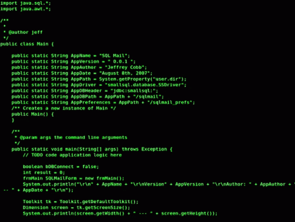

[
](url)
<table border="0">
 <tr>
    <td>
      <br>
     <p align="center">
    <td>
      
   </td>  
 </tr>  
</table>

<h2 align="center">MY INFORMATION :
</b></h3>

```go
using System;

public class Person
{
    public string name;
    public string username;
    public int age;
    public string job;
    public string[] hobbies;
}

class Program
{
    static void Main()
    {
        var me = new Person
        {
            name = "Miraç ÖZAL",
            username = "miracozal",
            age = 27,
            job = "Full-stack developer",
            hobbies = new string[] { "code", "music", "gaming", "walking", "nature sports" }
        };
        
        Console.WriteLine($"Name: {me.name}");
        Console.WriteLine($"Username: {me.username}");
        Console.WriteLine($"Age: {me.age}");
        Console.WriteLine($"Job: {me.job}");
        Console.Write("Hobbies: ");
        foreach (var hobby in me.hobbies)
        {
            Console.Write($"{hobby}, ");
        }
        Console.WriteLine();
    }
}

```

<p align="center"></p>

## 

<p align="center">
<a href="https://mail.google.com/mail/?view=cm&fs=1&to=mirac.ozal@gmail.com"></a></br>

<p align="center"></p>

## Spent My Time 

<br>

<p align="center"></p>

> Tools and technologies that I have worked with and I'm interested in

<table>
  <tr>
    <td align="center" width="96">
        
      <br>C#
    </td>
    <td align="center" width="96">
        
      <br>Javascript
    </td>
       <td align="center" width="96">
        
      <br>Github
    </td>
          <td align="center" width="96">
        
      <br>Rest API
    </td>
          <td align="center" width="96">
        
      <br>React
    </td>
        <td align="center" width="96">
        
      <br>Postman
    </td>
            <td align="center" width="96">
        
      <br>ASP.NET
    </td>
  </tr>
  <tr>
    <td align="center" width="96">
        
      <br>Git
    </td>
    <td align="center"  width="96">
        
      <br>HTML
    </td>
    <td align="center" width="96">
        
      <br>CSS
    </td>
    <td align="center"  width="96">
        
      <br>Bootstrap
    </td>
    <td align="center" width="96">
        
      <br>Tailwind
    </td>
        <td align="center" width="96">
        
      <br>JQuery
    </td>
        <td align="center" width="96">
        
      <br>PostgreSQL
    </td>
  </tr>
 <tr>
 </tr>
</table>

<p align="center"></p>

<p align="center"></p>

<p align="center"></p>


